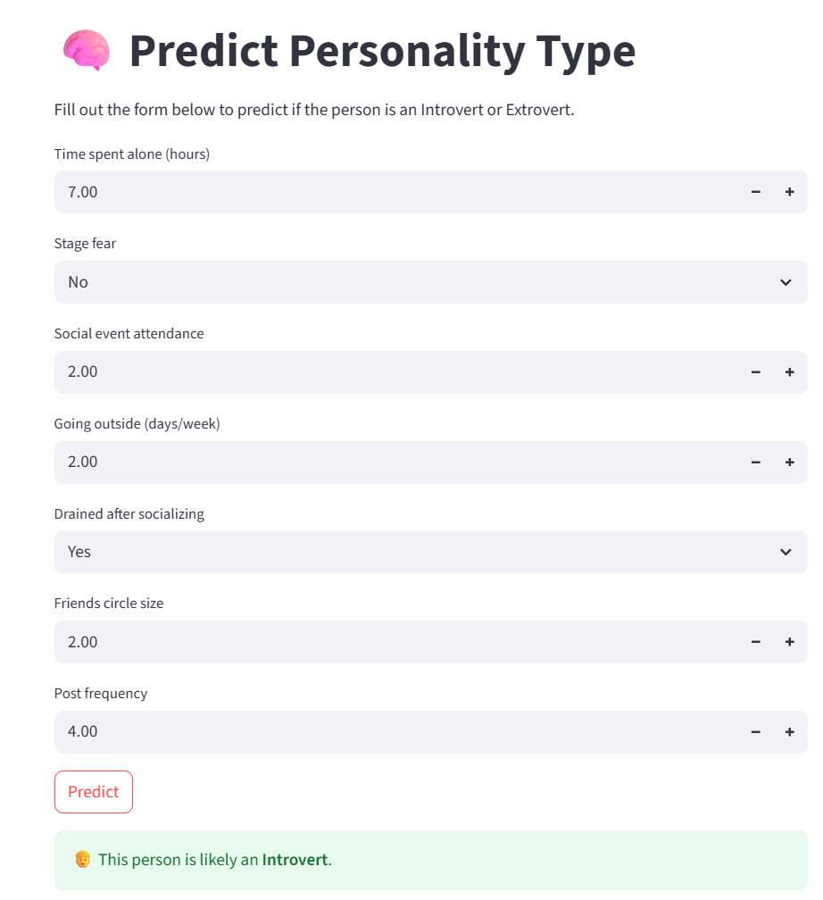

<!DOCTYPE html>
<html lang="en">

<body>

<h1>Personality Type Predictor (Introvert vs. Extrovert)</h1>

This project is a machine learning-powered web application that predicts whether a person is an <strong>Introvert</strong> or an <strong>Extrovert</strong> based on behavioral traits. It uses a <strong>CatBoostClassifier</strong> along with <strong>SMOTE</strong> to handle class imbalance and provides a simple Streamlit-based UI for predictions.

<h2>Features</h2>
<ul>
  <li>Clean and modular project structure</li>
  <li>Handles class imbalance using SMOTE</li>
  <li>Streamlit frontend for interactive predictions</li>
  <li>Encodes categorical variables using LabelEncoder</li>
  <li>Trained CatBoost model stored and re-used via .pkl</li>
  <li>Custom decoding logic for final prediction label</li>
</ul>

<h2>Dataset</h2>

  Source: <a href="https://www.kaggle.com/competitions/playground-series-s5e7/data" target="_blank">
  Kaggle Playground Series - Season 5 Episode 7</a> 
  The dataset contains behavioral attributes like:

<ul>
  <li>Time_spent_Alone</li>
  <li>Post_frequency</li>
  <li>Social_event_attendance</li>
  <li>Friends_circle_size</li>
  <li>Going_outside</li>
  <li>Drained_after_socializing</li>
  <li>Stage_fear</li>
</ul>

<strong>Target:</strong> Personality (0 = Extrovert, 1 = Introvert)

<h2>Project Structure</h2>
<pre>
personality-prediction/
│
├── app.py                     
├── main.py                    
├── requirements.txt           
├── README.md
│
├── data/
│   ├── train.csv
│   └── test.csv
│
├── models/
│   ├── model.pkl
│   └── label_encoders.pkl
│
├── notebooks/
│   └── kaggle introvert.ipynb  # EDA & experiment notebook
│
├── src/
│   ├── __init__.py
│   ├── data_loader.py
│   ├── preprocessing.py
│   ├── model_training.py
│   └── model_evaluation.py
│
├── Images/
│   └── prediction_result.png
</pre>

<h2>Sample Result</h2>

<h2>How to Run</h2>
<ol>
  <li><strong>Clone the repo:</strong>
    <pre>
git clone https://github.com/Nasrullah-chandio/personality-prediction.git
cd personality-prediction
    </pre>
  </li>
  <li><strong>Set up environment:</strong>
    <pre>
python -m venv venv
venv\Scripts\activate  # Windows
source venv/bin/activate  # Mac/Linux
pip install -r requirements.txt
    </pre>
  </li>
  <li><strong>Train the model (optional):</strong>
    <pre>
python main.py
    </pre>
  </li>
  <li><strong>Run the Streamlit app:</strong>
    <pre>
streamlit run app.py
    </pre>
  </li>
</ol>

<h2>Key Dependencies</h2>
<ul>
  <li>streamlit</li>
  <li>catboost</li>
  <li>scikit-learn</li>
  <li>imbalanced-learn</li>
  <li>pandas, numpy, joblib</li>
</ul>

<h2>Contact</h2>

  <strong>Your Name</strong> 
  GitHub: <a href="https://github.com/Nasrullah-chandio">github.com/Nasrullah-chandio</a> 
  LinkedIn: <a href="http://linkedin.com/in/nasrullahchandio">linkedin.com/in/nasrullahchandio</a>

</body>
</html>

